# my-intro-to-blender

## Section 1: Getting Going in Blender

Just learning the basics.

## Section 2: Your First 3D model in blender

Created A simple pyramid and a ship in a bottle, using only basic functions in Blender.

## Section 3: Bowling Ball & Pins

Getting started with curves, lighting, and rendering.

**Final Result:**

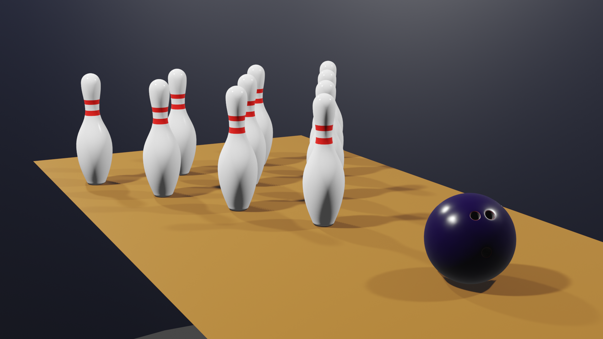 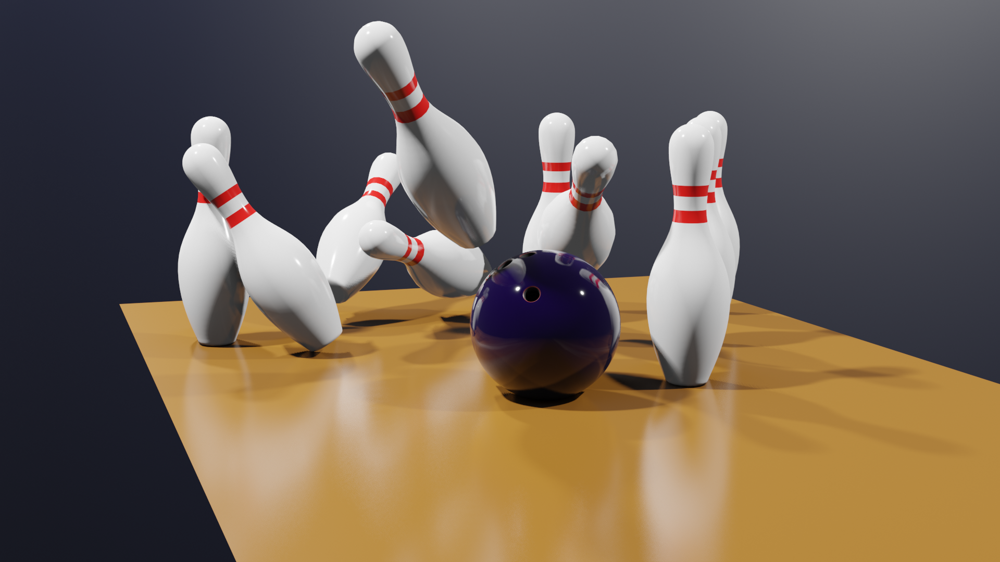

## Section 4: Low-Poly Chess Set

Improving upon modelling skills by creating a full set of low-poly chess pieces.

**Final Result:**

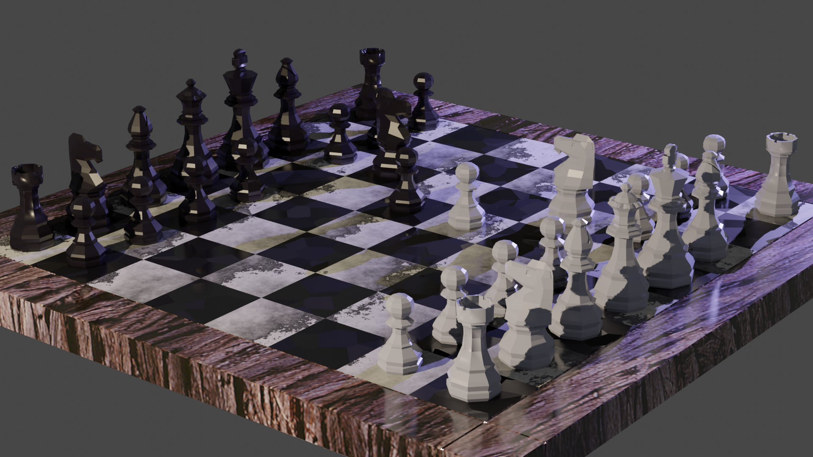 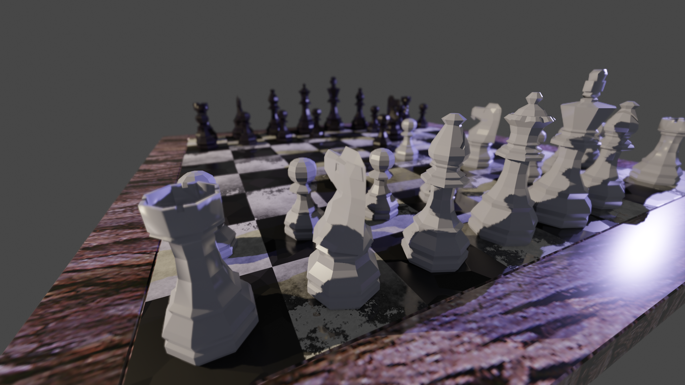 
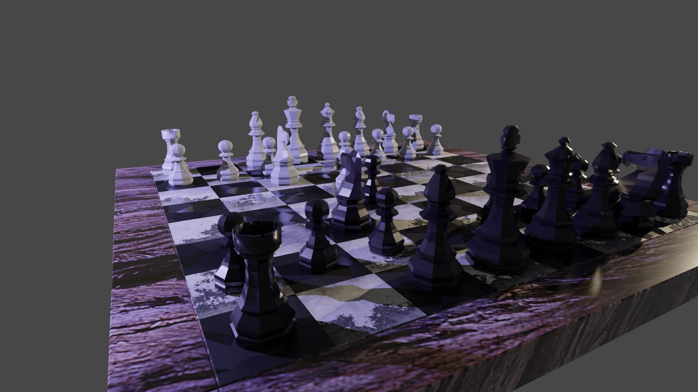 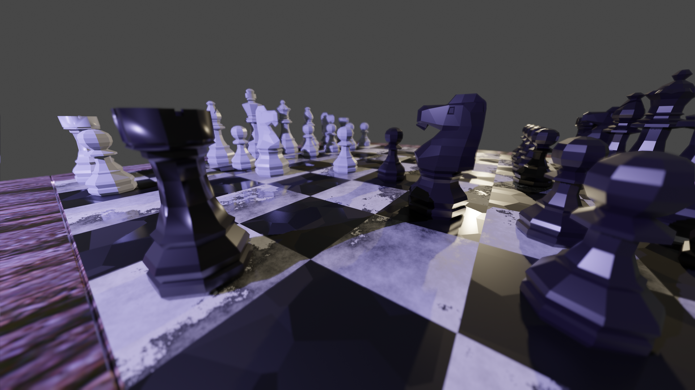 

## Section 5: Animated Lamp

More high-poly modelling, as well as an introduction to rigging and animation.

**Final Result:**

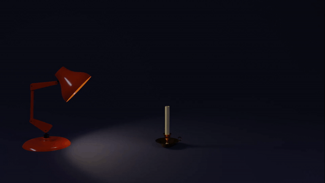

Full quality version can be viewed <a href="https://www.youtube.com/watch?v=NtAeypKr4B0" target="_blank">here</a>

## Section 6: Modular Dungeon

Texturing and UVs - learning to create assets for games.

**Final Result:**

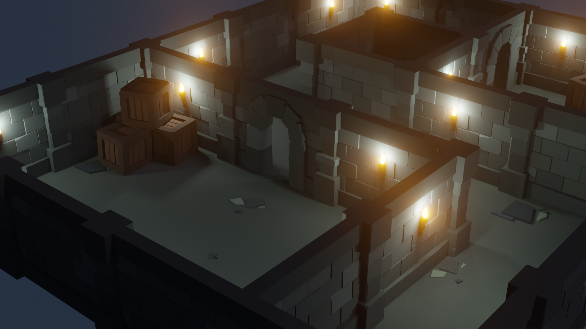 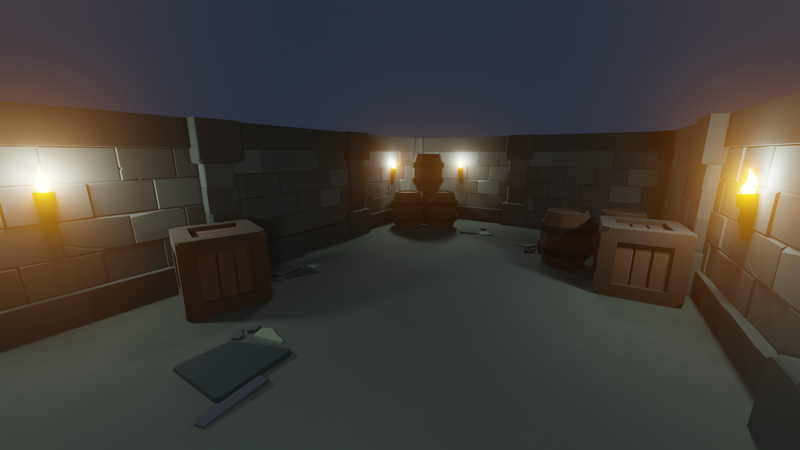 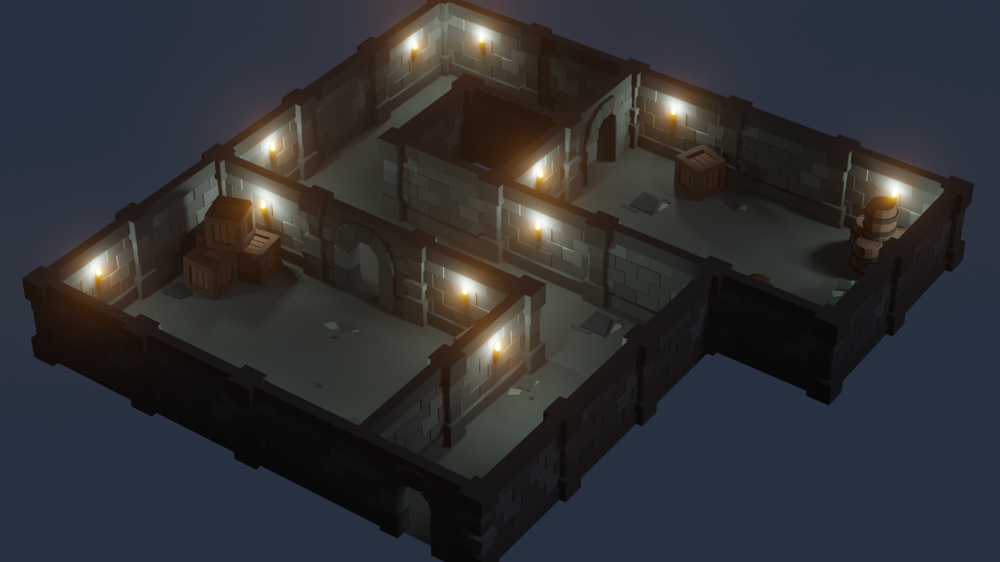

## Section 7: Furry Heads

Intro to sculpting and hair particle systems. 

**Final Result: Human Head**

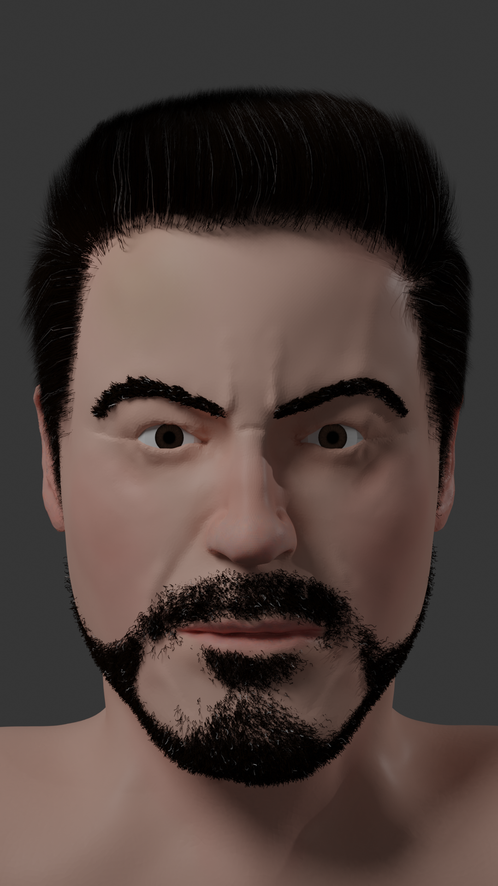

**Final Result: Animal**

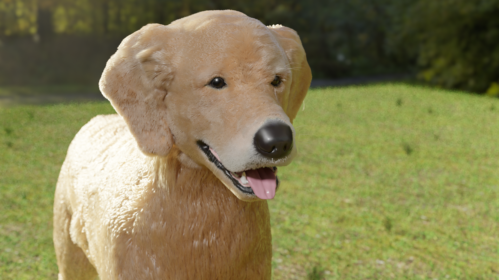
